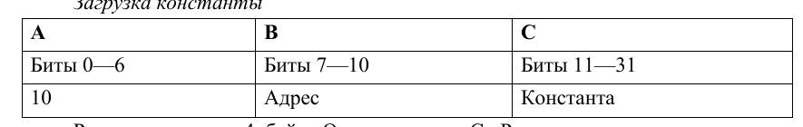
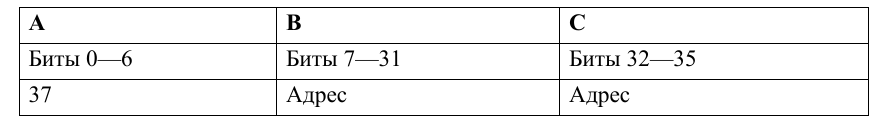
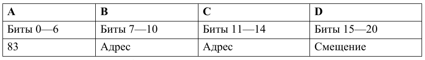
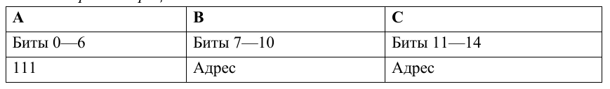

# Разработка кроссплатформенных программных систем
Группа ИКБО-21-22 Вариант 6


УВМ (Учебно вычислительная машина) поддерживает 4 команды:
1) Загрузка константы<br>
<br>
Размер команды: 4 байт. Операнд: поле C. Результат: регистр по адресу, 
которым является поле B. 
<br>

2) Чтение значения из памяти<br>
<br>
Размер команды: 5 байт. Операнд: значение в памяти по адресу, которым 
является поле B. Результат: регистр по адресу, которым является поле C. 
<br>
3) Запись значения в память<br> 
<br>
Размер команды: 3 байт. Операнд: регистр по адресу, которым является поле C. Результат: значение в памяти по адресу, которым является сумма адреса (регистр по адресу, которым является поле B) и смещения (поле D).
<br>
4) Бинарная операция: "<=" <br>
<br>
Размер команды: 2 байт. Первый операнд: регистр по адресу, которым 
является поле C. Второй операнд: значение в памяти по адресу, которым является 
регистр по адресу, которым является поле B. Результат: регистр по адресу, 
которым является поле C. <br>

# Пример программы 
Программа оформляется внутри json файла по следующему формату

```
{
    "program": {
        "name": "",
        "architecture": "x86_64",
        "os": "",
        "description": "",
        "instructions": [
		{
			"op": "load",
			"values": [13, 508]
		},
		{
			"op": "read",
			"values": [934, 14]
		},
		{
			"op": "write",
			"values": [13, 6, 7]
		},
		{
			"op": "bin_op",
			"values": [6, 4]
		}
		]
    }
}
```

В поле instructions передаются списки с операциями. В нулевом элементе списка содержится номер операции 

